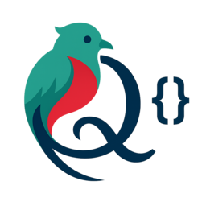

<p align="center">
  
</p>

<h1 align="center">Cambio API · qz-cambio-moneda-pdc</h1>

<p align="center">
  
  &nbsp;
  <strong>Tipo de cambio oficial USD → GTQ</strong>
  &nbsp;·&nbsp;
  Prueba de concepto con
  <a href="https://lenguaje-quetzal.com">Lenguaje Quetzal</a>
</p>

<p align="center">
  API que consulta el tipo de cambio del día desde
  <a href="https://www.banguat.gob.gt/">Banguat</a>
  y expone endpoints GET, POST y QUERY, junto con una interfaz web para probarlos.
</p>

<p align="center">
  <a href="http://tipo-cambio.lenguaje-quetzal.com/">Demo en vivo</a>
  ·
  <a href="https://github.com/AntaresGT/qz-cambio-moneda-pdc">Repositorio</a>
</p>

---

## ¿Qué es?

**Cambio API** es una demostración práctica de las capacidades de [Lenguaje Quetzal](https://lenguaje-quetzal.com): servidor HTTP, rutas, controladores, cliente HTTP asíncrono, JSON nativo y archivos estáticos, aplicadas a un caso real (tipo de cambio USD → GTQ).

| | |
|---|---|
| **Fuente de datos** | Banguat (SOAP `TipoCambioDia`) |
| **Monedas** | USD → GTQ |
| **Zona horaria** | `America/Guatemala` |
| **Puerto local** | `3000` |
| **Base pública** | `http://tipo-cambio.lenguaje-quetzal.com` |

---

## Características

- Servidor HTTP con estáticos en `./publico`
- Rutas y controladores en Quetzal (`.rt.qz` / `.ct.qz`)
- Cliente HTTP asíncrono hacia el web service de Banguat
- Métodos **GET**, **POST** y **QUERY** (experimental) sobre el mismo endpoint
- Interfaz web con playground, ejemplos y tipografía propia

---

## Ejecutar en local

Requisitos: [Lenguaje Quetzal](https://lenguaje-quetzal.com) instalado (`quetzal` en el PATH).

```bash
quetzal ejecutar
```

El servidor queda en [http://localhost:3000](http://localhost:3000).

---

## API

Endpoint base: `/api/tipo-cambio`

### GET — tipo de cambio del día

Sin parámetros. Devuelve el tipo de cambio de referencia USD → GTQ.

```bash
curl -X GET "http://localhost:3000/api/tipo-cambio" \
  -H "Accept: application/json"
```

**Respuesta (200):**

```json
{
  "estado": "exito",
  "fuente": "banguat",
  "fecha_consulta": "2026-08-09T11:41:00-06:00",
  "tipo_cambio": 7.65,
  "moneda_origen": "USD",
  "moneda_destino": "GTQ"
}
```

### POST / QUERY — conversión con monto

Envía un cuerpo JSON con `valor_dolares`. POST y QUERY agregan `valor_conversion` según el monto.

```bash
curl -X POST "http://localhost:3000/api/tipo-cambio" \
  -H "Content-Type: application/json" \
  -d '{"valor_dolares": 100}'
```

```bash
curl -X QUERY "http://localhost:3000/api/tipo-cambio" \
  -H "Content-Type: application/json" \
  -d '{"valor_dolares": 100}'
```

`QUERY` es un método HTTP experimental; el comportamiento es equivalente a POST en esta API.

### Error (500)

```json
{
  "estado": "error",
  "error": "Error al consultar el tipo de cambio, intente nuevamente.",
  "fecha_consulta": "2026-08-09T11:41:00-06:00"
}
```

---

## Estructura del proyecto

```
qz-cambio-moneda-pdc/
├── aplicacion/
│   ├── principal.qz                          # Servidor HTTP (puerto 3000)
│   └── servicios/tipo_cambio/
│       ├── tipo_cambio.rt.qz                 # Rutas GET / POST / QUERY
│       └── tipo_cambio.ct.qz                 # Controlador + cliente Banguat
├── publico/
│   ├── index.html                            # Interfaz Cambio API
│   ├── css/  js/
│   └── recursos/
│       ├── logo_lenguaje_quetzal.png
│       ├── ico_lenguaje_quetzal.png
│       └── icono_archivos_qz.png
├── README.md
└── Leeme.md
```

<p align="center">
  
</p>

<p align="center"><em>Código de aplicación en archivos <code>.qz</code></em></p>

---

## Flujo

```
Cliente  →  Cambio API (/api/tipo-cambio)  →  Banguat (SOAP)  →  JSON
```

1. El cliente llama a `/api/tipo-cambio`.
2. El controlador consulta el web service SOAP de Banguat.
3. Se extrae la referencia del día y se responde en JSON.

---

## Enlaces

| Recurso | URL |
|---------|-----|
| Demo | http://tipo-cambio.lenguaje-quetzal.com/ |
| GitHub | https://github.com/AntaresGT/qz-cambio-moneda-pdc |
| Banguat | https://www.banguat.gob.gt/ |
| Lenguaje Quetzal | https://lenguaje-quetzal.com |

---

<p align="center">
  
  <br>
  Hecho con <strong>Lenguaje Quetzal</strong> · Prueba de concepto · AntaresGT
</p>
